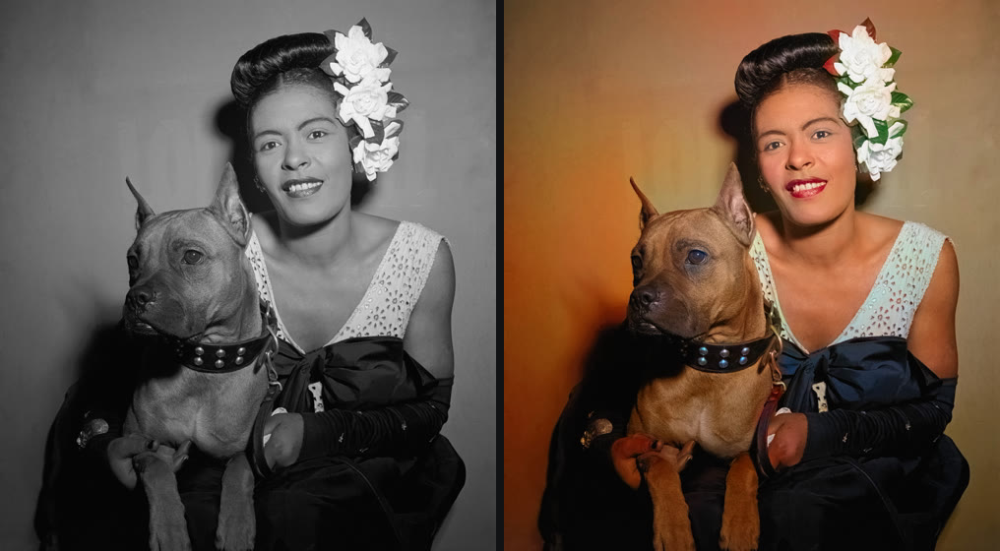
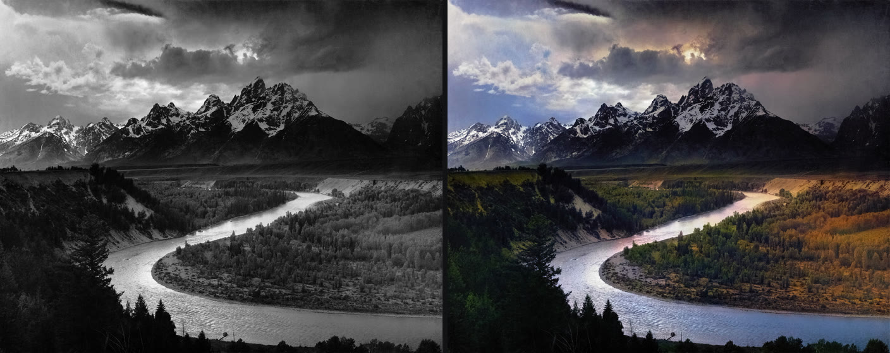

# Tinge

**Colour black-and-white photos and films, entirely on your own computer.**

Tinge is a desktop app for Windows and macOS. Drop in an old photo (or a whole
folder of them) and a few seconds later you have a colour version, at the full
resolution of the original. Drop in an old film and Tinge colours it frame by
frame, keeping the sound. No account, no upload, no subscription.





<sub>Examples coloured by Tinge, unedited. Photos: William P. Gottlieb, Library of Congress (public domain);
Ansel Adams, U.S. National Archives (public domain).</sub>

## Download

Grab the latest version from the [Releases page](https://github.com/gsleraar-hue/tinge/releases/latest):

| System | File |
| --- | --- |
| Windows 10/11 | `Tinge-Setup-x.y.z.exe` (installer) or `Tinge-x.y.z-portable.exe` (no install) |
| macOS on Apple Silicon (M1 and later) | `Tinge-x.y.z-arm64.dmg` |

On first start Tinge downloads its colour model once (about 980 MB). After that
it works offline.

**macOS:** the app is not notarised by Apple (that costs $99 a year). The first
time, right-click Tinge in Applications and choose **Open**, then **Open** again.
Intel Macs are not supported: the AI runtime Tinge uses only ships for Apple Silicon.

**Windows:** SmartScreen may warn about an unknown publisher. Choose
**More info → Run anyway**.

## What it does

- **Two styles.** *Natural* gives calm, believable colours, the best choice for
  portraits and family photos. *Vivid* lays the same colours on more strongly,
  lovely for landscapes, streets and postcards. Switching is instant.
- **Keeps every detail.** The AI only chooses the colours. Light and shade come
  straight from your original at full resolution, so nothing gets blurred or
  redrawn, and faces stay exactly as they were.
- **Before and after.** Drag across the photo to compare, or hold <kbd>Space</kbd>
  to see the original.
- **Fine-tuning.** Sliders for *Colour strength* and *Warmth* for when the result
  is a little too bold or too cool.
- **Batches.** Add as many photos as you like; they are coloured one by one.
  **Save all** writes them to a folder of your choice as `name (colour).jpg`.

## Films

Tinge also colours video: home movies, newsreels, whole feature films. Select a
video in the list and:

1. **Pick a preview frame** with the bar under the picture. It is coloured
   straight away, so you can try the style and sliders on the film itself.
2. **Choose the quality.** *Fast* lets the AI look at every 8th frame,
   *Balanced* at every 4th, *Best* at every frame. In between, Tinge fills in the
   colour itself, and it takes an extra look whenever a lot moves on screen.
3. **Choose the flicker filter.** The AI judges each frame on its own, so a coat
   could turn blue, then grey-blue, then blue again. The filter steadies the
   colour over time, but never across a scene cut and never on things that move,
   so colours do not trail behind a passing car.
4. **Colour video…** asks where to save the result, then gets to work. The panel
   shows how far it is and how long it will take.

A feature film is a job for a night or two: on an ordinary laptop *Fast* manages
roughly 2 to 4 frames a second, so 90 minutes takes somewhere around 10 to 20
hours. You can **pause** at any time and **continue** later, even after closing
Tinge or restarting the computer; at most the last 30 seconds of film are
redone. While a film is being coloured, the computer is kept from going to sleep.

The result is an MP4 (H.264) with the original sound (AAC). Tinge keeps the
original picture detail untouched and only adds colour.

Shortcuts: <kbd>Ctrl</kbd>/<kbd>⌘</kbd>+<kbd>O</kbd> add photos,
<kbd>Ctrl</kbd>/<kbd>⌘</kbd>+<kbd>S</kbd> save, <kbd>↑</kbd> <kbd>↓</kbd> previous/next photo.

## How it works

Tinge runs [DDColor](https://github.com/piddnad/DDColor) (Kang et al., ICCV 2023),
a neural network trained on millions of colour photos, through
[ONNX Runtime](https://onnxruntime.ai/) on your processor.

1. The photo is scaled down to a grey image of about 512 × 512 pixels, **in its
   own proportions** (a portrait squashed into a square looks wrong to the
   model), and **stretched to full contrast**, so faded prints with grey blacks
   are recognised as well as crisp ones.
2. The model answers with just the two colour channels (*a* and *b* in CIELAB).
3. **Purple is toned down.** Where DDColor is unsure (a cloth, a shadow, an
   overcast sky) it tends to fall back on magenta, a colour that was rare in
   old photographs. Reds and blues are left alone.
4. The colour is scaled back up with a **guided filter**, which makes colour
   edges follow the edges in the original. Without it, colour bleeds: lipstick
   onto skin, sky onto a roof, a yellow background into white flowers.
5. The colour is combined with the lightness (*L*) of the original photo at
   full size.

Step 5 is why the result is as sharp as the original: the model never touches
the detail, only the colour. For films the same idea works in the video's own
YUV format: the brightness plane of every frame passes through untouched and
Tinge writes only the two colour planes. [FFmpeg](https://ffmpeg.org/) does the
reading and writing of the video files. On an ordinary laptop a photo takes about 4 to 8
seconds; loading the model the first time adds a few seconds.

Like every automatic colouriser, DDColor guesses. It knows skin, sky, grass,
brick and wood very well, but it cannot know the colour of a particular dress
or car. Use the sliders, or pick the other style, when a guess is off.

## Building it yourself

You need [Node.js](https://nodejs.org/) 22 or later.

```bash
npm install
npm start          # run from source
npm test           # check the colour and video maths
npm run dist       # Windows installer + portable exe in dist/
npm run dist-mac   # macOS dmg + zip in dist/ (on a Mac)
```

The GitHub Actions workflow in [.github/workflows/build.yml](.github/workflows/build.yml)
builds both platforms and publishes a release whenever a `v*` tag is pushed.

To colour a film without the window (using the models Tinge has downloaded):

```bash
node dev/videotest.js old.mp4 coloured.mp4 fast
```

To test the whole photo pipeline without a window, point `TINGE_SELFTEST` at an
input and an output file. Tinge colours the photo, writes a report to
`selftest.json` in its data folder and quits:

```bash
TINGE_SELFTEST="old.jpg|coloured.jpg|natural" npx electron .
```

### Project layout

| File | What it does |
| --- | --- |
| `main.js` | Window, file dialogs, saving |
| `models.js` | Downloads the models and runs them with ONNX Runtime |
| `video.js` | Colours films: keyframes, scene cuts, chunks, pause and continue |
| `videocolor.js` | Per-frame video maths: colour planes, motion, smoothing |
| `renderer/color.js` | Colour maths: model input, Lab conversion, recombining at full size |
| `renderer/app.js` | The interface: list, queue, before/after view, sliders |
| `dev/make-icon.js` | Draws the app icon (`npm run icon`) |
| `dev/bench.js` | Colours a folder of photos in several variants side by side, to compare changes |

## Credits and licence

- Colourisation model: [DDColor](https://github.com/piddnad/DDColor) by Xiaoyang Kang et al.,
  Apache License 2.0. The ONNX exports are downloaded from the
  [FaceFusion assets](https://github.com/facefusion/facefusion-assets) release.
- AI runtime: [ONNX Runtime](https://github.com/microsoft/onnxruntime) by Microsoft, MIT License.
- Video: [FFmpeg](https://ffmpeg.org/), shipped as an unmodified binary from the
  [ffmpeg-static](https://github.com/eugeneware/ffmpeg-static) package. That build
  is licensed under the GPL (version 3 or later); its licence and build notes are
  inside the app next to the binary, and the source code is available from
  [ffmpeg.org](https://ffmpeg.org/download.html). Tinge runs it as a separate
  program.
- Tinge itself: [MIT License](LICENSE).
